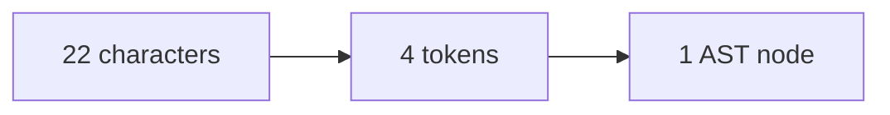
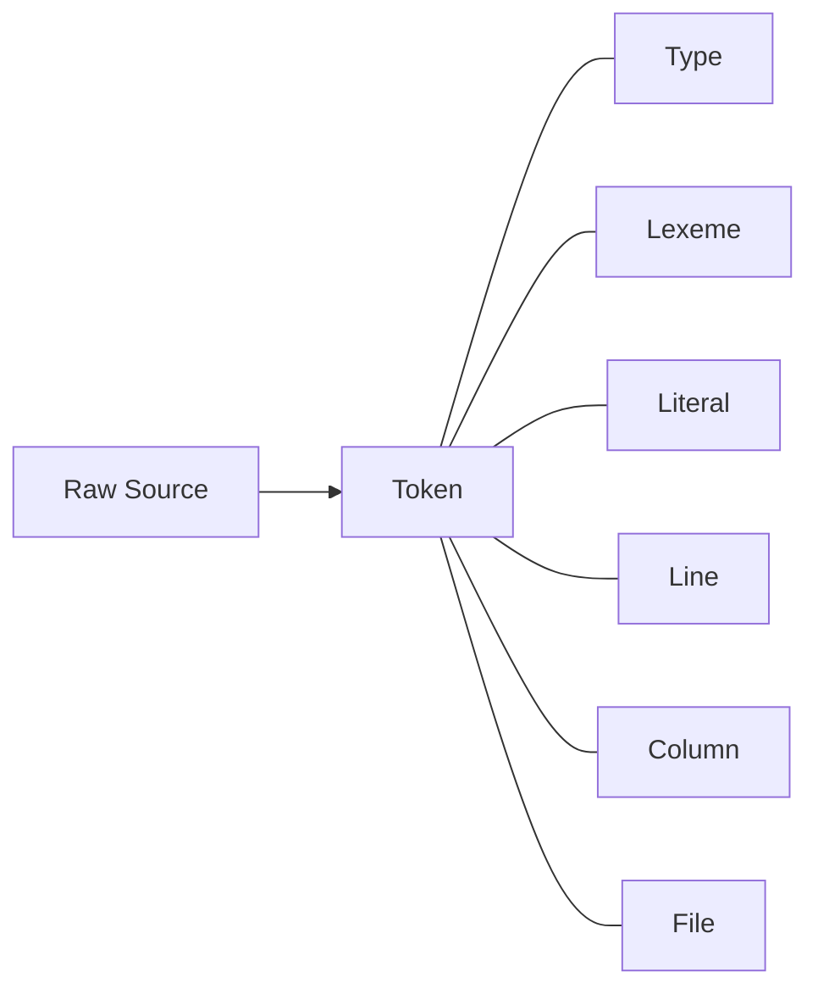

## Introduction

Scanning is the first step in taking raw source code and turning it into a useable format that the interpreter can use to execute. Scanning is also arguably the easiest step in the process and can written by hand in a clean and maintainable manner.

## What Is Scanning?

In short, scanning is the process of converting raw text into a series of **tokens**. Tokens are small data structures that store information that Ghost's parser and interpreter use later for things like reporting errors and actually executing code.

<callout>**Tokens** are the smallest elements of a programming language. They can range from single characters (`+`) to a range of characters (`class`).</callout>

The act of scanning is also referred to as _lexing_, _lexical analysis_, _tokenizing_, and probably some other terms. For the sake of simplicity, Ghost refers to this step simply as _scanning_.

The scanner takes in raw source code, and walks through it character-by-character extracting everything out into a series of tokens.

As an example, let's look at this simple print statement in Ghost:

```typescript
print("Hello, world!")
```

The resulting tokens would then be the following:

```
IDENTIFIER("print")
LEFTPAREN("(")
STRING("Hello, world!")
RIGHTPAREN(")")
```

These series of tokens are much easier to work with than the individual characters we started with. That, in a nutshell, sums up the entire process of interpreting a programming language. At each step of the process we're creating bigger and bigger representations of our code.



## Tokens

Tokens themselves are nothing more than constants defined within Go. In Ghost, all tokens are defined within the `token` package -- here's what they all look like at the time of this writing:

```go
const (
	// single-character tokens
	COLON        = ":"
	COMMA        = ","
	LEFTBRACE    = "{"
	LEFTBRACKET  = "["
	LEFTPAREN    = "("
	MINUS        = "-"
	PLUS         = "+"
	QUESTION     = "?"
	RIGHTBRACE   = "}"
	RIGHTBRACKET = "]"
	RIGHTPAREN   = ")"
	SEMICOLON    = ";"
	SLASH        = "/"
	STAR         = "*"
	PERCENT      = "%"

	// one or two character tokens
	BANG         = "!"
	BANGEQUAL    = "!="
	DOT          = "."
	DOTDOT       = ".."
	EQUAL        = "="
	EQUALEQUAL   = "=="
	GREATER      = ">"
	GREATEREQUAL = ">="
	LESS         = "<"
	LESSEQUAL    = "<="
	PLUSEQUAL    = "+="
	MINUSEQUAL   = "-="
	STAREQUAL    = "*="
	SLASHEQUAL   = "/="

	// literals
	IDENTIFIER = "IDENTIFIER"
	STRING     = "STRING"
	NUMBER     = "NUMBER"

	// keywords
	AND      = "and"
	AS       = "as"
	BREAK    = "break"
	CASE     = "case"
	CLASS    = "class"
	CONTINUE = "continue"
	ELSE     = "else"
	EXTENDS  = "extends"
	FALSE    = "false"
	FOR      = "for"
	FROM     = "from"
	FUNCTION = "function"
	IF       = "if"
	IMPORT   = "import"
	IN       = "in"
	NULL     = "null"
	OR       = "or"
	PRINT    = "print"
	RETURN   = "return"
	SUPER    = "super"
	SWITCH   = "switch"
	THIS     = "this"
	TRUE     = "true"
	WHILE    = "while"
	EOF      = "eof"
	INVALID  = "__INVALID__"
)
```

## Token Struct

Token's themselves not only hold the token representation itself, but other useful information on its makeup. Ghost uses this additional information at later stages for evaluation or in cases of errors.

Ghost's token type struct looks like the following - we'll go over each of the properties after:

```go
type Token struct {
	Type    Type
	Lexeme  string
	Literal interface{}
	Line    int
	Column  int
	File    string
}
```

### Type

The `Type` property holds the value of one of the previous token constants. This is determined during the scanning process and attached to the token instance.

### Lexeme

The `Lexeme` property holds the _value_ of the token in **string** format. This is useful for debugging and error reporting.

### Literal

The `Literal` property holds the _value_ of the token in its native format. For example, if we have a `NUMBER` token, it's Literal value would be an `int64`.

<callout>In Ghost, we make use of a decimal package to add arbitrary-precision fixed-point decimal numbers. The scope of this is way beyond this post, but in short this gives us the ability to cleanly evaluate things like `2.3 + 2.3 == 2.6`.</callout>

### Line

The `Line` property holds which line the token is found on. This is particularly helpful for error reporting.

### Column

The `Column` property holds the column where the token is found on its given line. This is particularly helpful for error reporting.

### File

The `File` property holds the filename the token is found in. This is particularly helpful for error reporting.



## Scanning
...

---

## Notes

- The first step in the compilation process is scanning.
- Scanning is the process of taking the "raw" source code, and walking through the text character-by-character and transforming them into a series of **tokens**.
- Tokens are part of whats called the **lexical grammar**.
- Lexical grammar describes the structure of the language's vocabulary.

## Glossary

| Term              | Definition                                                                                                                                                                    |
| ----------------- | ----------------------------------------------------------------------------------------------------------------------------------------------------------------------------- |
| Token             | Tokens are the smallest elements of a programming language. They can range from single characters (+) to a range of characters (class).                                       |
| Lexical Grammar   | A lexical grammar is a formal grammar defining the syntax of tokens.                                                                                                          |
| Lexical Structure | The lexical structure is the set of basic rules that governs how programs are written.                                                                                        |
| Lexeme            | Lexemes are the raw substrings of scanned source code. Lexemes are used to create tokens.                                                                                     |
| Literal           | Literals are the literal representation of the lexeme in the "parent" language (e.g. 5 represented as an int64 in Go). These can be used in the interpreter at a later stage. |